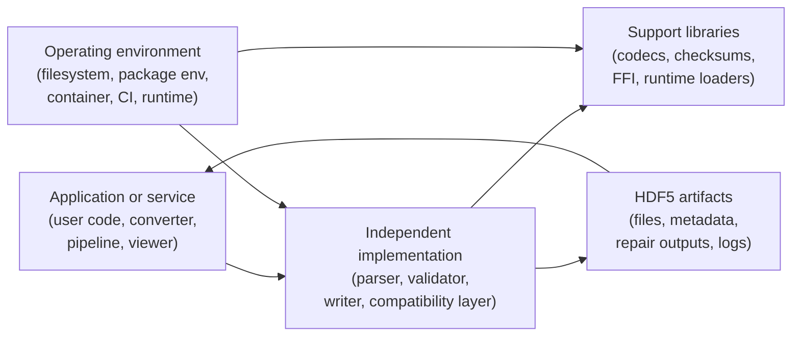

# HDF5 Independent Implementation Model

This document defines a practical safety, security, and privacy model for independent HDF5 implementations that read and write HDF5 files directly from the file format specification rather than wrapping the reference HDF5 library. Examples include Rust implementations such as `rustyhdf5`, managed-runtime implementations such as `PureHDF` and `JHDF`, and similar projects in other languages.

It builds on the core models in [Safety Hazard.md](./Safety%20Hazard.md), [Security Threats.md](./Security%20Threats.md), and [Privacy Exposure.md](./Privacy%20Exposure.md). Those documents define the base hazard, attack, and exposure vocabulary for HDF5 itself. This document explains how independent implementations change the trust boundary, move more correctness burden into the implementation itself, and add implementation-specific review questions.

## Contents

- [1) Scope and SSP goals](#1-scope-and-ssp-goals)
- [2) HDF5 Independent Implementation (H5II) model in one page](#2-hdf5-independent-implementation-h5ii-model-in-one-page)
- [3) Threat enumeration workflow](#3-threat-enumeration-workflow)
- [4) Practical examples](#4-practical-examples)
- [5) Independent implementation review register template](#5-independent-implementation-review-register-template)
- [6) Threat taxonomy aligned with HDF5 SSP SIG vulnerability categories](#6-threat-taxonomy-aligned-with-hdf5-ssp-sig-vulnerability-categories)
- [7) Checklists for reviewers](#7-checklists-for-reviewers)

## 1) Scope and SSP goals

The purpose of this model is to help analyze the combined safety, security, privacy, and interoperability properties that must hold when an implementation parses, validates, and emits HDF5 structures on its own rather than delegating those responsibilities to `libhdf5`. The model is designed to help reviewers identify and mitigate risks that arise from spec interpretation gaps, partial feature support, parser and writer correctness, codec integration, and compatibility claims.

### In scope

- independent HDF5 readers, writers, validators, converters, and inspectors
- implementations in Rust, C#, Java, Go, C++, or other languages that parse or emit HDF5 without wrapping the reference library
- parser, serializer, validator, and metadata traversal logic for superblocks, object headers, B-trees, heaps, chunk indexes, datatypes, dataspaces, links, references, filters, and related structures
- implementation-defined support profiles: read-only, read-write, partial feature support, fallback behavior, and compatibility claims
- external dependencies used by the implementation: compression codecs, checksum libraries, FFI layers, JNI/P/Invoke bridges, temp-file handling, and packaging/runtime loaders
- privacy-relevant behavior such as generated metadata, logs, temp files, repair outputs, and compatibility reports

### Out of scope

- rewriting the HDF5 file format specification
- proving complete conformance to every HDF5 feature and version
- replacing the core HDF5 safety, security, or privacy models
- assuming that using a memory-safe or managed language removes the need for SSP review

### Working assumptions

1. An independent implementation moves parser and writer trust directly into the implementation itself rather than into a wrapped native library.
2. Partial support is normal, but unsupported or unknown features must fail closed rather than being silently ignored or guessed.
3. If an implementation writes files, interoperability and structural correctness are SSP concerns, not just quality concerns.
4. Memory-safe and managed languages reduce some bug classes, but logic errors, resource exhaustion, privacy leakage, unsafe FFI, and supply-chain compromise remain relevant.
5. Independent implementations need explicit cross-validation against other tools, corpora, and the specification because HDF5 edge cases are numerous and easy to misinterpret.

### Primary goals

- **Parse safety:** untrusted files must not trigger crash, corruption, pathologically expensive work, or unexpected code-loading paths.
- **Fail-closed compatibility:** unsupported, unknown, ambiguous, or out-of-profile features must be rejected or clearly surfaced rather than silently reinterpreted.
- **Write correctness and interoperability:** emitted files must match claimed semantics and remain safe for other HDF5 tools to consume.
- **Resource containment:** large counts, nested metadata, chunk maps, and decompression paths must not create unbounded CPU, memory, disk, or I/O amplification.
- **Operational clarity:** users should understand what HDF5 subset is supported, what is intentionally unsupported, and when compatibility guarantees stop.
- **Privacy protection:** metadata, logs, repair outputs, and analysis artifacts should not leak sensitive information.
- **Supply chain integrity:** dependencies, codecs, generated binaries, and compatibility claims should be attributable and reviewable.

## 2) HDF5 Independent Implementation (H5II) model in one page

Independent implementations remove one dependency on the reference HDF5 library, but they do not remove the hard problems. The trusted computing base now includes the implementation's own parser, validator, writer, compatibility logic, and any support libraries it uses for codecs, checksums, or platform integration.



### What matters in practice

- **Application layer:** decides which files to trust, which feature subset to allow, and whether parsed results can affect decisions or downstream writes.
- **Implementation layer:** owns file structure parsing, semantic validation, fallback behavior, and any write-path guarantees it claims.
- **Support libraries:** codecs, checksum libraries, and FFI layers can reintroduce native code, decompression risk, or packaging drift.
- **HDF5 artifacts:** the implementation may emit files, repair outputs, indexes, logs, or compatibility reports that other tools will trust.
- **Operating environment:** package provenance, classpath or assembly resolution, environment variables, filesystem permissions, and CI/runtime settings influence real behavior.

### The core independent implementation idea

For independent implementations, the combined issue chain is usually:

> **Trigger -> Interpretation gap -> SSP outcome**

Common interpretation gaps are:

- a malformed or edge-case file reaches parser logic that misreads the specification
- an unsupported feature is accepted with lossy fallback or silent omission
- a writer emits bytes that look plausible but violate downstream assumptions
- filter or external-reference metadata activates support libraries or expensive decode paths
- diagnostic, repair, or compatibility tooling publishes metadata the user did not intend to share

That is why this model reuses the core HDF5 hazard, attack, and exposure families, but anchors them at spec interpretation, feature-subset boundaries, and writer interoperability claims.

## 3) Threat enumeration workflow

Use this workflow for each parser feature, write path, compatibility claim, deployment pattern, or file-handling mode.

### Step 0 - Set deployment and compatibility assumptions

Document:

- whether inputs are trusted, internal-only, partner-supplied, or internet-facing
- whether the implementation is read-only, read-write, streaming, repair-oriented, or conversion-oriented
- which HDF5 versions and features are claimed to be supported
- whether the process holds secrets, network access, filesystem write access, or high-value downstream authority

### Step 1 - Model the supported subset and fail-closed boundaries

List:

- supported superblock versions, object header versions, datatypes, links, references, chunk layouts, and filters
- unsupported or partially supported features and exactly how they fail
- writer guarantees: round-trip fidelity, canonicalization, lossy conversion, or best-effort output
- external dependencies: codecs, filesystem helpers, FFI bridges, network or object-store clients

### Step 2 - Enumerate the likely issue families

Map each path to the core models:

- **Safety:** silent misparse, invalid output, stale state, resource exhaustion, partial-write hazards
- **Security:** parser bugs, unsafe external dependency use, external-link abuse, decompression bombs, supply-chain compromise
- **Privacy:** metadata leakage, diagnostic artifacts, repair logs, provenance overcollection
- **Interoperability:** files are accepted or written with semantics different from what other tools will observe

Then ask which part of the implementation makes the underlying HDF5 issue easier to reach or harder for users to notice.

### Step 3 - Identify trigger and interpretation-gap pairs

Useful pairs to enumerate every time:

- malformed structure -> parser assumption about offsets, counts, or object graph shape
- unsupported message or feature -> silent ignore, coercion, or default value insertion
- datatype or dataspace metadata -> integer overflow, allocation blowup, precision loss, or wrong shape reconstruction
- filter metadata -> external codec use, decompression amplification, or loader drift
- write API call -> output file that violates structural or semantic expectations of other readers
- debug or repair path -> logs, temp outputs, compatibility reports, archived artifacts

### Step 4 - Derive controls and safe defaults

Turn the issue into concrete implementation requirements:

- "The implementation shall publish an explicit supported-feature matrix and reject unsupported features by default."
- "Unknown object-header messages, link types, and filter pipelines shall fail closed unless a reviewed compatibility mode exists."
- "Write paths shall be verified by round-trip and cross-tool interoperability tests before release."
- "Resource-heavy parsing and decompression paths shall be bounded by size, count, and work limits."
- "Compatibility and repair tooling shall redact or minimize metadata in logs and exported reports."

### Step 5 - Attach evidence

Every meaningful implementation issue should map to evidence such as:

- malformed-file tests and fuzzing
- corpus-based differential testing against reference tools or other implementations
- round-trip write and reopen tests across multiple readers
- resource-limit tests for large counts, chunk maps, and compressed payloads
- privacy and artifact scans
- packaging, SBOM, and provenance evidence for dependencies and release artifacts

### Step 6 - Register and tag the result

Record each issue in an implementation review register and tag it with one or more SSP categories from Section 6. The output should be:

- implementation-specific risks tied to the underlying HDF5 model
- explicit compatibility and fail-closed controls
- verification evidence
- release and operations guidance

## 4) Practical examples

### Example 1 - Unsupported feature is silently accepted

**Scenario:** A partial HDF5 reader encounters an object-header message, link form, datatype feature, or chunk-index variant it does not fully implement, but it continues with a guessed or incomplete interpretation.

- Trigger: opening a file that uses a valid but unsupported or uncommon HDF5 feature
- Interpretation gap: implementation treats "not understood" as "safe to ignore" or coerces the structure into a simpler model
- SSP outcome: wrong results, hidden data loss, policy bypass, or downstream corruption if the file is rewritten
- Common tags: **FMT**, **LIB**, **OPS**
- Related core models: safety hazards H1/H5, CASSE `Data • Poisoning • Core library`
- Typical controls: explicit support matrix, fail-closed parsing, differential tests with edge-case corpora, compatibility modes that are opt-in and documented

### Example 2 - Writer emits a non-portable or unsafe file

**Scenario:** An independent writer produces a file that appears valid to itself but violates structural or semantic expectations of other HDF5 readers.

- Trigger: create, convert, or rewrite operation in a read-write implementation
- Interpretation gap: implementation's write logic or canonicalization rules do not preserve required HDF5 invariants or interoperability expectations
- SSP outcome: silent corruption, downstream open failure, stale reads, or incorrect scientific results
- Common tags: **FMT**, **LIB**, **OPS**
- Related core models: safety hazards H1/H3, CASSE `Library • Modification • Storage`
- Typical controls: cross-reader round-trip tests, invariant validation before close, corpus-based reopen tests, clear documentation when output is profile-limited rather than general-purpose HDF5

### Example 3 - Codec support reintroduces native or decompression risk

**Scenario:** A file uses compressed chunks or custom filters, and the implementation routes chunk data through support libraries that are expensive, unsafe, or unexpectedly loaded.

- Trigger: opening a file with gzip, szip, third-party, or application-specific filter metadata
- Interpretation gap: file metadata influences codec choice, decompression work, or native/FFI loading beyond what users realize
- SSP outcome: denial of service, crash, memory corruption, or code execution through support libraries
- Common tags: **EXT**, **TCD**, **SCD**
- Related core models: safety hazard H7, CASSE `Data • Poisoning • External libraries`, privacy exposure P4/P6
- Typical controls: codec allowlists, work-factor limits, isolated parsing for untrusted files, dependency provenance, and tests that cover malformed compressed chunks

### Example 4 - Compatibility tooling amplifies privacy leakage

**Scenario:** A validator, repair tool, or converter emits object names, attribute values, file paths, sample payloads, or inferred compatibility notes into logs, reports, temp files, or CI artifacts.

- Trigger: debug run, failed conversion, repair attempt, or automated compatibility scan
- Interpretation gap: operational tooling is treated as harmless even though it republishes sensitive metadata outside the original boundary
- SSP outcome: disclosure beyond the intended audience
- Common tags: **PRV**, **OPS**, **TCD**
- Related core models: privacy exposure P1/P4/P6, safety hazard H8
- Typical controls: safe logging defaults, redaction in reports, reviewed fixtures, artifact retention limits, and privacy review for support outputs

## 5) Independent implementation review register template

Use this template when documenting implementation-specific issues, design reviews, or release gates.

```markdown
## II-###: <short name>
- Implementation: <name / language / runtime>
- Support profile: <read-only|read-write|converter|validator|repair|other>
- SSP category tags: <FMT|LIB|EXT|TCD|OPS|PRV|SCD|UNK>
- Primary lens: <safety|security|privacy|interop|mixed>
- Related core model references:
  - Safety hazard:
  - Security threat:
  - Privacy exposure:
- Trigger:
- Interpretation gap:
- Outcome:
- Preconditions:
- Supported / unsupported feature assumptions:
- Trust assumptions:
- Controls / mitigations:
  - Parser / validation controls:
  - Writer / interoperability controls:
  - Process / environment controls:
  - Packaging / provenance controls:
- Tests / evidence:
  - Malformed-input or fuzz test:
  - Differential or cross-tool test:
  - Round-trip or writer validation:
  - Resource-bound or privacy review:
- Owner / status / milestone:
- Links:
```

## 6) Threat taxonomy aligned with HDF5 SSP SIG vulnerability categories

Use the issue families below as the independent-implementation vocabulary. They are intentionally mapped back to the core HDF5 safety, security, and privacy models.

### Independent implementation issue families

| Indie ID | Independent implementation issue family | Description |
| --- | --- | --- |
| **I1** | Parser/spec divergence | The implementation interprets valid or malformed HDF5 structures differently than intended by the specification. |
| **I2** | Fail-open compatibility behavior | Unsupported, unknown, or partially implemented features are silently ignored, coerced, or downgraded. |
| **I3** | Writer correctness and interoperability failure | The implementation emits files that violate invariants, misstate semantics, or are only self-consistent to that implementation. |
| **I4** | Codec, filter, or external reference boundary failure | Support for filters, checksums, external links, or other auxiliary mechanisms expands the trusted computing base or triggers unsafe behavior. |
| **I5** | Numeric, structural, or resource amplification | Sizes, counts, layouts, decompression, or traversal patterns create pathological CPU, memory, disk, or I/O demand. |
| **I6** | Concurrency, durability, or lifecycle mismatch | Streaming, caching, partial writes, file replacement, or multi-process usage creates stale state or misleading completion semantics. |
| **I7** | Metadata, diagnostics, and artifact exposure | Logs, reports, fixtures, temp files, and generated metadata disclose sensitive information. |
| **I8** | Dependency, provenance, or compatibility-claim drift | Codecs, transitive dependencies, runtime loaders, or published support claims do not match what is actually shipped. |
| **I9** | Trust-boundary confusion | Users treat an independent implementation as "just parsing data" even when it can trigger complex parsing, codec execution, external access, or lossy rewriting. |

### Alignment table

| Vulnerability category | What it looks like in an independent implementation review | Independent implementation families most often involved |
| --- | --- | --- |
| **FMT** (File format) | parser or writer logic misreads on-disk structures, mishandles edge cases, or emits non-portable metadata | I1, I2, I3, I5 |
| **LIB** (Core library) | implementation-local parser, validator, cache, traversal, and writer behavior creates crashes, wrong results, or unsafe fallbacks | I1, I2, I3, I5, I6, I9 |
| **EXT** (Extensions/plugins) | filters, codecs, external links, or auxiliary libraries expand what file content can trigger | I4, I9 |
| **TCD** (Toolchain/deps) | runtime loaders, compression libraries, packaging, converters, and CI tooling change behavior or leak artifacts | I4, I7, I8 |
| **OPS** (Operational/usage) | users rely on unsupported compatibility, run untrusted files without containment, or trust lossy rewrite paths | I2, I3, I5, I6, I7, I9 |
| **PRV** (Privacy-specific) | metadata, reports, debug output, temp files, and retained fixtures expose sensitive information | I7 |
| **SCD** (Supply Chain/dist.) | compromised dependencies, mutable codecs, mismatched release artifacts, or overstated compatibility claims mislead users | I4, I8 |
| **UNK** (Unknown) | new implementation-specific issue chains that do not fit the known families yet | any |

## 7) Checklists for reviewers

### When a change touches parser logic or adds feature support

- [ ] Is the supported subset explicit for this feature, including version and edge-case limitations?
- [ ] Does the parser fail closed on unknown, unsupported, or malformed structures rather than silently coercing them?
- [ ] Are there malformed-input, corpus, or differential tests covering the new path?
- [ ] Could success here still mean wrong semantics compared with other HDF5 tools?

### When a change touches write paths or file generation

- [ ] Does the implementation verify the invariants it claims before reporting success?
- [ ] Are output files tested with at least one independent reader other than the implementation itself?
- [ ] Could canonicalization, lossy conversion, or omitted metadata change meaning without making that visible to users?
- [ ] Are partial-write, crash, or replace-on-write behaviors documented for the deployment context?

### When a change touches filters, codecs, external links, or support libraries

- [ ] Can file metadata influence what dependency, codec, or external access path is used?
- [ ] Are codecs and external mechanisms allowlisted, bounded, and attributable?
- [ ] Does the change reintroduce native code through FFI, JNI, P/Invoke, or platform libraries?
- [ ] Are malformed compressed inputs and high-expansion cases tested?

### When a change touches concurrency, streaming, or large-file handling

- [ ] Could large counts, nested metadata, or chunk maps cause pathological resource use?
- [ ] Are integer conversions, allocation sizes, and shape calculations validated before use?
- [ ] Is behavior under concurrent access, caching, or streaming modes clearly defined?
- [ ] Is subprocess or worker isolation needed for untrusted-file handling?

### When a change touches diagnostics, packaging, or compatibility claims

- [ ] Do logs, reports, fixtures, or temp outputs include real data, paths, identifiers, or sample values?
- [ ] Are published support claims narrower than the real tested surface, or wider?
- [ ] Are dependencies, codecs, and release artifacts attributable with scanning or SBOM evidence?
- [ ] Do docs clearly say what happens for unsupported features and when files should be treated as untrusted?
