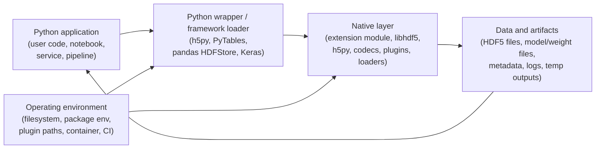

# HDF5 Python Wrapper Model

This document defines a practical safety, security, and privacy model for Python wrappers around native HDF5 libraries, with emphasis on `h5py`, `PyTables`, PyTables-based consumers such as `pandas.HDFStore`, and Python ML/framework loaders that consume HDF5-backed model or weight artifacts.

It builds on the core models in [Safety Hazard.md](./Safety%20Hazard.md), [Security Threats.md](./Security%20Threats.md), and [Privacy Exposure.md](./Privacy%20Exposure.md). Those documents define the base hazard, attack, and exposure vocabulary for HDF5 itself. This document explains how the Python wrapper layer changes the trust boundary, expands the attack surface, and adds wrapper-specific review questions.

**Related evidence:** Recent model-loading work, including [*On the (In)Security of Loading Machine Learning Models*](https://arxiv.org/abs/2509.06703), shows that HDF5-backed ML artifacts can become application-level execution or disclosure paths when framework loaders reconstruct model objects, callables, or external references. The practical rule for this model is: untrusted model artifacts are not inert data just because they use HDF5 or another data-based container. See also the [Keras security advisories](https://github.com/keras-team/keras/security) for examples involving legacy HDF5 model loading and HDF5 external storage in model workflows.

## Contents

- [1) Scope and SSP goals](#1-scope-and-ssp-goals)
- [2) HDF5 Python Wrapper (H5PW) model in one page](#2-hdf5-python-wrapper-h5pw-model-in-one-page)
- [3) Threat enumeration workflow](#3-threat-enumeration-workflow)
- [4) Practical examples](#4-practical-examples)
- [5) Wrapper review register template](#5-wrapper-review-register-template)
- [6) Threat taxonomy aligned with HDF5 SSP SIG vulnerability categories](#6-threat-taxonomy-aligned-with-hdf5-ssp-sig-vulnerability-categories)
- [7) Checklists for reviewers](#7-checklists-for-reviewers)

## 1) Scope and SSP goals

The purpose of this model is to help in analyzing the combined safety, security, and privacy properties that must hold when Python code drives native HDF5 parsing, storage, plugins, and object serialization paths. The model is designed to help reviewers identify and mitigate risks that arise from the Python-to-native transition, wrapper convenience features, and deployment patterns.

### In scope

- Python wrappers over native HDF5 libraries, especially `h5py` and `PyTables`
- Python ML/framework loading paths that depend on HDF5-backed artifacts, including legacy `.h5`/`.hdf5` model files, `.weights.h5` weight files, and archives that embed HDF5 weights
- CPython extension modules, Cython/CFFI glue, and vendored or dynamically linked native libraries
- wrapper-visible HDF5 features: datasets, groups, attributes, filters, VFDs, VOLs, links, references, external storage, and object-like storage patterns
- installation and runtime environments: wheels, package managers, shared libraries, plugin search paths, CI, notebooks, HPC jobs, and services
- privacy-relevant wrapper behavior such as logs, temp files, metadata generation, and object serialization

### Out of scope

- full API documentation for `h5py`, `PyTables`, or pandas
- proving wrapper correctness or native memory safety
- replacing the core HDF5 safety, security, or privacy models

### Working assumptions

1. The Python-to-native transition is an ABI boundary, not a security boundary.
2. A native parsing bug, plugin load, or unsafe deserialization path can compromise the entire Python process.
3. Python-level controls help, but process isolation is the strongest practical containment boundary.
4. Wrapper defaults, convenience features, framework loaders, and ecosystem patterns can turn "data handling" into code execution, corruption, or disclosure.
5. Self-contained model artifacts are executable-adjacent: if a loader reconstructs layers, callables, custom objects, asset paths, or external references, the artifact must be treated as untrusted code unless provenance and containment say otherwise.
6. A flag, file extension, hub label, or scanner result is not a security boundary unless the specific HDF5/legacy path enforces it and fails closed when it cannot.
7. The wrapper risk profile depends on deployment context: notebook, desktop, HPC job, CI worker, batch pipeline, or service.

### Primary goals

- **Execution safety:** untrusted files, plugins, and serialized objects must not become implicit code execution paths.
- **Crash containment:** native faults and resource exhaustion should not take down more of the system than necessary.
- **Data integrity and correctness:** wrapper features should not hide corruption, stale state, or unsafe concurrency behavior.
- **Operational clarity:** users should understand what is trusted, what may be loaded dynamically, and what features cross security boundaries.
- **Loader semantics clarity:** wrappers and framework consumers should distinguish arrays-only loading from model/object reconstruction, plugin loading, external-reference traversal, and asset loading.
- **Trust-signal correctness:** security flags, safe modes, scanner labels, file extensions, and warnings should match enforceable behavior for every supported format.
- **Privacy protection:** wrapper-generated metadata, logs, temp files, and object serialization should not leak sensitive information.
- **Supply chain integrity:** installed wheels, shared libraries, codecs, and plugins should be attributable and reviewable.

## 2) HDF5 Python Wrapper (H5PW) model in one page

Python wrappers add a layer of convenience, but they do not create a hard safety or security boundary. Once Python imports the wrapper, the trusted computing base expands to include the wrapper extension module, the HDF5 library, native dependencies, and any dynamically loaded plugins.



### What matters in practice

- **Application layer:** Python code decides what to open, trust, serialize, publish, and log; ML code also decides which model artifacts to load and execute.
- **Wrapper layer:** wrapper APIs can make dangerous native, object-reconstruction, or serialization paths feel like ordinary Python operations.
- **Framework loader layer:** model loaders may interpret HDF5-backed content as architecture, weights, layers, callables, custom objects, asset paths, or external file references.
- **Native layer:** `libhdf5`, `h5py`, codecs, plugins, and loaders are where many safety and execution risks actually live.
- **Data and artifacts:** HDF5 content may carry malformed structures, plugin-triggering metadata, pickled objects, Lambda/custom-object semantics, external storage, external links, sensitive names, or retained artifacts.
- **Operating environment:** wheels, shared library search paths, plugin directories, environment variables, package provenance, model hubs, and filesystem permissions often decide whether the wrapper behaves safely.

### The core wrapper idea

For Python wrappers, the combined issue chain is usually:

> **Trigger -> Boundary crossing -> SSP outcome**

Common boundary crossings are:

- Python opens a file that drives native parsing
- a wrapper loads or enables native plugins
- a wrapper deserializes Python objects from "data"
- a framework loader reconstructs model architecture, layers, callables, assets, or external references from an HDF5-backed artifact
- a `safe_mode`, scanner label, signature, or file extension is treated by the user as a boundary even though that boundary is not enforced for the active path
- logs, errors, or temp outputs publish metadata the user did not intend to share

That is why this model reuses the core HDF5 hazard, attack, and exposure families, but anchors them at the Python-to-native boundary and the wrapper feature set.

## 3) Threat enumeration workflow

Use this workflow for each wrapper feature, deployment pattern, or file-handling path.

### Step 0 - Set deployment and trust assumptions

Document:

- whether inputs are trusted, internal-only, partner-supplied, model-hub supplied, paper-supplement supplied, or internet-facing
- whether the workload is a notebook, batch job, CI worker, service, or multi-tenant environment
- where wrappers, native libraries, plugins, model artifacts, and converters are installed from
- whether security flags, safe modes, or scanner labels are used, and which HDF5/legacy paths they actually cover
- whether the process holds secrets, network access, GPU/accelerator access, or write access to valuable data

### Step 1 - Model the wrapper stack and boundary crossings

List:

- Python entry points: open, read, write, convert, inspect, serialize, query, `load_model`, `load_weights`, and model-hub download/load flows
- native transitions: parser calls, codec paths, plugin loading, file-link traversal, external storage resolution
- wrapper-added features: object storage, metadata conveniences, implicit conversions, error or debug paths
- framework-added features: model graph reconstruction, layer/callable resolution, custom object handling, asset loading, training configuration loading
- environmental influences: search paths, environment variables, package resolution, filesystem permissions, network permissions, model-cache locations

### Step 2 - Enumerate the likely issue families

Map each path to the core models:

- **Safety:** crash, deadlock, corruption, stale state, resource exhaustion
- **Security:** native memory corruption, unsafe deserialization, plugin injection, model/object reconstruction, trust-signal bypass, supply-chain compromise
- **Privacy:** metadata leakage, artifact retention, logging disclosure, external-reference reads, cross-file inference

Then ask which wrapper behavior makes the underlying HDF5 issue easier to reach or harder for users to see.

### Step 3 - Identify trigger and boundary-crossing pairs

Useful pairs to enumerate every time:

- untrusted file -> native parser or codec
- file metadata -> plugin or connector load
- object-like storage -> pickle or equivalent deserialization
- HDF5-backed model artifact -> framework loader -> model architecture, layer, callable, or custom-object reconstruction
- HDF5 weight artifact -> external storage, external link, or asset-path traversal -> local file or network access
- security flag or scanner label -> unsupported legacy path -> trust-signal failure
- wrapper convenience API -> implicit file traversal, path following, or object reconstruction
- debug or CI path -> logs, temp outputs, crash dumps, archived artifacts

### Step 4 - Derive controls and safe defaults

Turn the issue into concrete wrapper requirements:

- "The wrapper deployment shall disable or strictly constrain dynamic plugin loading unless explicitly required."
- "Files from outside the trust boundary shall be opened in a separate process for inspection or conversion."
- "Object serialization features shall not be used for untrusted or redistributed files."
- "Model artifact loading from outside the trust boundary shall run in a sandbox or low-privilege worker."
- "A `safe_mode` or equivalent security flag shall be enforced for the exact format path being loaded, or the load shall fail closed with explicit feedback."
- "HDF5 artifact inspection shall reject external links, external storage, unexpected plugin/filter requirements, object-like metadata, and path-bearing attributes unless explicitly allowlisted."
- "Wrapper release workflows shall document native dependency and plugin provenance."

### Step 5 - Attach evidence

Every meaningful wrapper issue should map to evidence such as:

- negative tests with malformed files
- fuzzing or sanitizer coverage on native paths
- subprocess isolation tests
- plugin loading policy tests
- model-loader tests that prove safe/security flags are enforced or fail closed for each supported extension and legacy path
- external-link and external-storage blocking tests for untrusted artifacts
- scanner-coverage checks that identify unsupported formats rather than labeling them safe by omission
- metadata and artifact scans
- packaging or SBOM evidence for native dependencies

### Step 6 - Register and tag the result

Record each issue in a wrapper review register and tag it with one or more SSP categories from Section 6. The output should be:

- wrapper-specific risks tied to the underlying HDF5 model
- concrete deployment controls
- verification evidence
- release and operations guidance

## 4) Practical examples

### Example 1 - Untrusted HDF5 file reaches native parsing through `h5py`

**Scenario:** A service or notebook opens a file from outside the trust boundary with `h5py`, and native parsing hits a malformed structure.

- Trigger: opening an untrusted `.h5` file
- Boundary crossing: Python wrapper -> native HDF5 parser or codec
- SSP outcome: crash, memory corruption, possible code execution
- Common tags: **FMT**, **LIB**
- Related core models: safety hazards H1/H5/H6, CASSE `Data • Poisoning • Core library`
- Typical controls: subprocess isolation, patched native dependencies, negative tests, fuzzing, fail-closed parsing

### Example 2 - PyTables object storage turns data into code

**Scenario:** A workflow reads a PyTables file that stores arbitrary Python objects and triggers unpickling or equivalent object reconstruction.

- Trigger: loading a file treated as inert data
- Boundary crossing: wrapper convenience feature -> Python object deserialization
- SSP outcome: arbitrary code execution and possible privacy loss
- Common tags: **LIB**, **OPS**, **PRV**
- Related core models: CASSE `Data • Poisoning • Application`, privacy exposure P4/P7
- Typical controls: avoid object storage for shared files, refuse untrusted object deserialization, require provenance and explicit opt-in

### Example 3 - Plugin search path hijack compromises the Python process

**Scenario:** File metadata or environment configuration causes HDF5 to load a malicious filter, VFD, or VOL plugin while a wrapper opens the file.

- Trigger: plugin-capable file plus untrusted plugin search path
- Boundary crossing: wrapper open path -> native dynamic loading
- SSP outcome: arbitrary native code execution, privacy exfiltration, or corruption
- Common tags: **EXT**, **SCD**, **OPS**
- Related core models: safety hazard H7, CASSE `Data • Poisoning • External libraries`, privacy exposure P4/P6
- Typical controls: disable plugins when not needed, allowlist plugin directories, sign and verify artifacts, isolate high-risk parsing jobs

### Example 4 - Wrapper workflow amplifies privacy leakage

**Scenario:** A converter or notebook workflow writes subject identifiers, file paths, sample values, or host details into HDF5 attributes, logs, and archived artifacts.

- Trigger: export, debug, or failed CI run
- Boundary crossing: wrapper convenience and operations -> metadata and artifact publication
- SSP outcome: disclosure beyond intended audience
- Common tags: **PRV**, **OPS**, **TCD**
- Related core models: privacy exposure P1/P4/P6
- Typical controls: metadata linting, safe logging defaults, reviewed fixtures, artifact retention limits, release privacy notes

### Example 5 - Legacy HDF5 model loading defeats the user's security expectation

**Scenario:** A Python ML workflow loads a legacy `.h5` or `.hdf5` model artifact using a framework API that exposes a security-sounding flag. The loader path reconstructs model objects or Lambda/custom-layer state from HDF5-backed content, but the relevant control is unsupported, incomplete, or not applied to the legacy path.

- Trigger: loading a shared model artifact from a hub, repository, paper supplement, or partner workflow
- Boundary crossing: framework loader -> HDF5-backed model metadata -> object, layer, callable, or custom-object reconstruction
- SSP outcome: arbitrary code execution, policy bypass, or misleading trust feedback
- Common tags: **LIB**, **TCD**, **OPS**, **SCD**
- Related core models: CASSE `Data • Poisoning • Application`, wrapper families W2/W8/W9
- Typical controls: treat model artifacts as code, prefer weights-only or constrained formats for cross-boundary sharing, disable legacy self-contained loading for untrusted files, require explicit provenance, enforce or reject security flags per format, and run untrusted loads in a sandboxed worker

### Example 6 - HDF5 external references disclose local files during weight loading

**Scenario:** A weight file or model archive contains HDF5 external storage, external links, or path-bearing metadata that a framework follows while loading weights or assets. The model loader reads files from the host filesystem and makes their bytes observable through model state, inference output, logs, or re-saved artifacts.

- Trigger: loading a `.weights.h5`, `.h5`, `.hdf5`, or embedded-HDF5 weight artifact from outside the trust boundary
- Boundary crossing: framework loader -> `h5py`/`libhdf5` file-reference resolution -> local filesystem or asset path
- SSP outcome: local file disclosure, secret leakage, confused-deputy file access, or privacy breach
- Common tags: **FMT**, **LIB**, **PRV**, **OPS**
- Related core models: CASSE `Data • Poisoning • Application`, privacy exposure P4/P6, wrapper families W8/W10
- Typical controls: reject external storage and external links for untrusted artifacts, inspect artifacts before full model loading, run loaders with a restricted filesystem namespace, keep secrets out of readable paths, and record file-reference policy in deployment documentation

## 5) Wrapper review register template

Use this template when documenting wrapper-specific issues, design reviews, or release gates.

```markdown
## PY-###: <short name>
- Wrapper / consumer: <h5py|PyTables|pandas.HDFStore|other>
- Deployment pattern: <notebook|desktop|batch|CI|service|HPC|other>
- SSP category tags: <FMT|LIB|EXT|TCD|OPS|PRV|SCD|UNK>
- Primary lens: <safety|security|privacy|mixed>
- Related core model references:
  - Safety hazard:
  - Security threat:
  - Privacy exposure:
- Trigger:
- Boundary crossing:
- Outcome:
- Preconditions:
- Trust assumptions:
- User-facing security claim / flag:
- Loader semantics: <arrays only|model graph|custom objects|external links/storage|pickled objects|asset loading|unknown>
- Unsupported or legacy paths:
- Isolation / privileges:
- Controls / mitigations:
  - Wrapper or API controls:
  - Process / environment controls:
  - Packaging / provenance controls:
- Tests / evidence:
  - Negative or malformed-input test:
  - Isolation test:
  - Plugin / packaging validation:
  - Privacy or artifact review:
- Owner / status / milestone:
- Links:
```

## 6) Threat taxonomy aligned with HDF5 SSP SIG vulnerability categories

Use the wrapper issue families below as the Python-specific vocabulary. They are intentionally mapped back to the core HDF5 safety, security, and privacy models.

### Wrapper issue families

| Wrapper ID | Wrapper issue family | Description |
| --- | --- | --- |
| **W1** | Native parser or codec compromise | A file or payload reaches native parsing or decoding and triggers crash, corruption, or code execution. |
| **W2** | Code in data | A wrapper or framework feature turns file content into executable code, deserialized Python objects, model layers, callables, or custom objects. |
| **W3** | Dynamic loader boundary failure | Plugin, codec, VOL, VFD, or shared-library loading is influenced by file content, environment, or packaging drift. |
| **W4** | Concurrency and lifecycle mismatch | Wrapper locking, GC timing, threads, file handles, or process model create deadlocks, corruption, or stale state. |
| **W5** | Resource exhaustion and amplification | File content or wrapper behavior drives pathological CPU, memory, metadata, or I/O consumption. |
| **W6** | ABI, dependency, or packaging drift | Wheels, native libs, build flags, or shared-library versions do not line up safely. |
| **W7** | Metadata, log, and artifact exposure | Wrapper usage leaks sensitive information through attributes, logs, temp files, test fixtures, or crash artifacts. |
| **W8** | Trust-boundary confusion | Users treat HDF5 as inert data even though the wrapper can cross into native code, plugins, object deserialization, model reconstruction, or external reference traversal. |
| **W9** | Misleading safety/security signal | A file extension, `safe_mode`, scanner label, signature status, or warning implies a boundary that is not enforced for the active format or loader path. |
| **W10** | External reference traversal | HDF5 external links, external storage, asset paths, or loader-level file references cause unexpected local file or network access. |

### Alignment table

| Vulnerability category | What it looks like in a Python wrapper review | Wrapper families most often involved |
| --- | --- | --- |
| **FMT** (File format) | malformed file structures, external references, and parser hot paths are reachable through ordinary wrapper APIs | W1, W5, W10 |
| **LIB** (Core library) | native extension faults, unsafe object handling, lifecycle bugs, wrapper defaults, deserialization paths, framework-loader semantics | W1, W2, W4, W6, W8, W9, W10 |
| **EXT** (Extensions/plugins) | filters, VFDs, VOLs, or wrapper plugins extend the trusted computing base at runtime | W3, W8 |
| **TCD** (Toolchain/deps) | wheels, native dependencies, converters, wrappers, framework loaders, and CI tooling change behavior or introduce artifacts | W6, W7, W9 |
| **OPS** (Operational/usage) | user workflows treat files as safe, allow unsafe sharing, over-trust safe labels, or run high-risk parsing without containment | W4, W5, W7, W8, W9, W10 |
| **PRV** (Privacy-specific) | metadata, object storage, logs, temp files, external file reads, and artifact retention expose sensitive information | W2, W7, W10 |
| **SCD** (Supply Chain/dist.) | package compromise, plugin substitution, mutable build inputs, unverified binaries, or untrusted shared model artifacts | W3, W6, W8, W9 |
| **UNK** (Unknown) | new wrapper-specific chains that do not fit the known families yet | any |

## 7) Checklists for reviewers

### When a change touches object storage, serialization, convenience loading, or model reconstruction

- [ ] Can file content become executable code, reconstructed Python objects, model layers, callables, or custom objects?
- [ ] Is the feature safe for untrusted or redistributed files, or must it stay explicitly trust-scoped?
- [ ] Are unsafe features opt-in, clearly documented, and tested with hostile inputs?
- [ ] Is provenance or signature verification required before deserialization or model reconstruction?

### When a change touches ML model or weight loading

- [ ] Is the artifact arrays-only, weights-only, or self-contained model/object state?
- [ ] Does the loader reconstruct Lambda layers, custom objects, callables, training configuration, assets, or external references?
- [ ] Is every `safe_mode` or equivalent security flag enforced for every supported extension, including legacy `.h5`/`.hdf5` paths?
- [ ] Do unsupported or partially supported paths fail closed with explicit error or warning rather than silently continuing?
- [ ] Does preflight inspection reject external links, external storage, unexpected plugin/filter requirements, and path-bearing metadata for untrusted artifacts?
- [ ] Are untrusted model loads isolated from secrets, the network, writable production data, and other tenants?

### When a change touches native calls, plugins, or shared libraries

- [ ] Does the change expand the native trusted computing base?
- [ ] Can environment variables, search paths, or file metadata influence what native code is loaded?
- [ ] Are plugin and loader behaviors disabled, allowlisted, or validated by default?
- [ ] Are fuzzing, sanitizer, or malformed-input tests covering the new path?

### When a change touches concurrency, lifecycle, or process model

- [ ] Could threads, GC timing, open handles, or multiprocessing create deadlocks or stale state?
- [ ] Is subprocess isolation needed for untrusted file handling?
- [ ] Are file sharing and locking assumptions documented for the deployment context?
- [ ] Does failure stay contained to a worker process where possible?

### When a change touches build, packaging, or release automation

- [ ] Are wheel contents, native dependencies, and build inputs attributable and pinned?
- [ ] Is there evidence for dependency scanning, SBOM generation, or artifact verification?
- [ ] Could the packaging path introduce different runtime behavior than source builds?
- [ ] Are untrusted CI jobs separated from trusted release jobs?

### When a change touches metadata, logs, fixtures, or artifacts

- [ ] Do logs, test fixtures, crash dumps, or temp outputs contain real data, file paths, or identifiers?
- [ ] Could wrapper-generated metadata expose more than the raw dataset was meant to reveal?
- [ ] Are artifact retention and publication rules documented?
- [ ] Is there a privacy review for exported files and supporting artifacts, not just the main `.h5` file?
