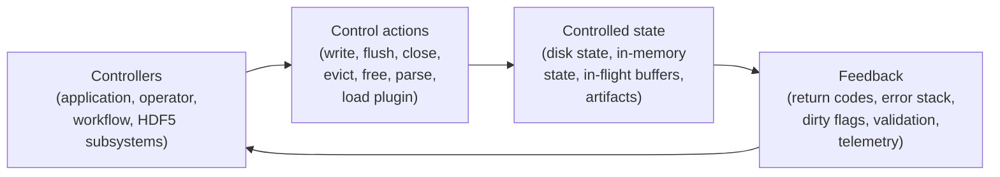

# HDF5 Safety Hazard Model

This document defines a practical hazard model for the HDF5 library and file format. It is meant to expose accident chains, turn them into concrete constraints and tests, and keep safety work aligned with the HDF5 SSP SIG vulnerability taxonomy used across the repository.

**Reference:** [Review of Systems-Theoretic Process Analysis (STPA) Method and Results to Support NextGen Concept Assessment and Validation](https://www.ll.mit.edu/sites/default/files/publication/doc/2018-12/Harkleroad_2013_ATC-427.pdf)

## Contents

- [1) Scope and safety goals](#1-scope-and-safety-goals)
- [2) HDF5 Control System (H5CS) model](#2-hdf5-control-system-h5cs-model)
- [3) Hazard enumeration workflow](#3-hazard-enumeration-workflow)
- [4) Practical examples](#4-practical-examples)
- [5) Hazard register template](#5-hazard-register-template)
- [6) Hazard taxonomy aligned with HDF5 SSP SIG vulnerability categories](#6-hazard-taxonomy-aligned-with-hdf5-ssp-sig-vulnerability-categories)
- [7) Checklists for reviewers](#7-checklists-for-reviewers)

## 1) Scope and safety goals

Our primary goal is to keep HDF5 files, tools, and workflows out of unsafe states.

### In scope

- open HDF5 files, where truth is split across disk, memory, and in-flight buffers
- read paths and parse paths for malformed, partial, or stale files
- core library subsystems such as metadata cache, chunk cache, free-space manager, object header handling, B-tree and heap handling
- extension points such as VOL connectors, VFDs, filters, wrappers, and plugins
- operational realities: crashes, power loss, concurrent access, weak durability assumptions, misconfiguration, and unsafe deployment defaults

### Out of scope

- proving full correctness of the library
- assuming transactional semantics or a write-ahead log exists today
- prescribing a single mitigation strategy such as journaling, copy-on-write, or checksums

### Working assumptions

1. Crashes happen: process abort, `SIGKILL`, node reboot, power loss, kernel panic, out-of-memory kill.
2. Write ordering is not guaranteed unless a specific layer explicitly provides it.
3. API success does not automatically mean durable-on-disk success.
4. Extensions run inside the process boundary unless explicitly isolated.
5. Parallel I/O, threads, and distributed workflows increase timing and ordering hazards.

### Primary safety goals (what we protect)

- **File integrity:** the file remains parseable and internally consistent at defined safe points.
- **Data correctness:** reads return the data that was actually committed, or a clearly documented durable prefix.
- **Durability truthfulness:** `flush`, `close`, and similar signals must not overstate what is safely persisted.
- **Availability:** files and tools should fail safe, remain recoverable where possible, and avoid cascading breakage.
- **In-memory safety:** internal structures should not drift into states that cause wrong writes, wrong frees, or silent corruption.
- **Privacy protection:** metadata, logs, temporary artifacts, and extension behavior should not leak sensitive information.
- **Long-term interpretability:** files designated for retention remain readable and semantically interpretable for their retention horizon, either directly or through a preserved fallback path.

## 2) HDF5 Control System (H5CS) model

An open HDF5 file behaves like a control system. Controllers issue actions that change a hybrid state spread across disk, memory, and in-flight I/O. Hazards arise when those actions are disrupted, happen in the wrong context, in the wrong order, or without enough validation.



### What matters in practice

- **Controllers:** application code, HDF5 API layers, metadata cache, free-space manager, chunk cache, plugin loaders, parts of the OS or filesystem stack that influence persistence, archive curator, package/distribution manager, plugin registry, signing/CA infrastructure, and integrator.
- **Control actions:** emit durable bytes, mark dirty or clean, evict entries, reuse free space, parse structures, load extensions, and signal durability, record dependency manifest, archive plugin artifact, verify compatibility, transcode to archival profile, and revalidate/migrate before support ends.
- **Controlled state:** on-disk metadata and raw data, in-memory caches and indices, in-flight writes, temporary files, logs, and plugin search paths.
- **Feedback:** return codes, error stacks, file locking outcomes, validation results, checksums, reopen behavior, and monitoring signals.

### The core safety idea

For HDF5, the unsafe condition is usually not a single event. It is a state mismatch such as:

- durable metadata points at bytes that are not yet durable
- memory and disk disagree with no safe reconciliation path
- free space is reused while stale references can still become reachable
- an extension produces output that violates core invariants

That is why the hazard unit in this model is:

> **Trigger -> Unsafe state -> Loss**

### Note - misleading safety and security feedback

A security-sounding file extension, `safe_mode`, scanner label, signature status, or hub label is feedback in the control system. It becomes safety-relevant when the feedback causes an operator, wrapper, framework, or workflow to choose a more dangerous control action than it otherwise would: for example, loading an untrusted HDF5-backed model artifact in a privileged Python process because the file appears to be data-only or because a security flag appears to apply.

For HDF5 SSP reviews, treat this as an unsafe feedback hazard:

- Trigger: a user-facing trust signal is present, ambiguous, unsupported for a legacy path, or produced by a scanner with incomplete format coverage
- Unsafe state: the workflow believes an artifact is constrained while the active loader can still reconstruct objects, execute code-bearing state, follow external references, load plugins, or disclose local files
- Loss: code execution, privacy breach, corrupted workflow output, service compromise, or unsafe redistribution of a malicious artifact
- Common tags: **LIB**, **TCD**, **OPS**, **SCD**, and sometimes **FMT** or **PRV**
- Typical controls: make trust signals format-specific, fail closed when a security mode cannot be enforced, document what each flag or label does not cover, and require isolation for untrusted model or object artifacts

## 3) Hazard enumeration workflow

Use this workflow for each subsystem, feature, or design change.

### Step 0 - Set boundaries and assumptions

Document:

- what state the subsystem owns on disk, in memory, and in flight
- what inputs are untrusted or only partially trusted
- what durability or concurrency guarantees users think they have
- what operating environments matter: local FS, HPC FS, object store, plugin-rich workflow, cloud service

### Step 1 - Build the control model

List:

- controllers
- control actions
- controlled state
- feedback channels
- trust or coordination boundaries

For HDF5, the minimum set is usually: application, HDF5 subsystem, extension boundary, OS/filesystem, and storage.

### Step 2 - Enumerate unsafe states

Describe hazards as state conditions, not events. Good hazard statements look like:

- on-disk metadata is internally inconsistent
- in-memory state diverges from disk without a safe replay or repair path
- durability-signaling actions can complete before required bytes are actually safe
- sensitive metadata can escape through logs or artifacts
- the file requires an external decoder that is unavailable or unverifiable
- plugin semantics are required but not durably recorded
- a compatible decoder exists but cannot be rebuilt or trusted

### Step 3 - Enumerate unsafe control actions

For each control action, ask the four standard Systems-Theoretic Process Analysis (STPA)-style questions:

1. Was the action not provided when needed?
2. Was it provided when it was unsafe?
3. Was it provided in the wrong order or at the wrong time?
4. Was it applied too long, too short, or only partially?

The control actions worth checking every time are:

- write metadata or raw data
- flush or close
- mark dirty or clean
- evict or reuse
- parse a structure
- load or call an extension

### Step 4 - Derive constraints and mitigations

Turn each unsafe control action into a testable constraint:

- "The library shall not report flush success until required metadata ordering constraints are met."
- "The subsystem shall reject extension outputs that violate address and size invariants."
- "The parser shall fail closed on malformed offsets or counts."

Then define prevention, detection, recovery, and containment measures.

### Step 5 - Attach evidence

Every meaningful hazard should map to at least one of:

- crash-injection or reopen tests
- malformed-input and fuzz cases
- concurrency or interleaving tests
- sanitizer or static-analysis coverage
- runtime invariants, assertions, telemetry, or validation tooling

### Step 6 - Register and tag the result

Record the hazard in the register and tag it with one or more SSP categories from Section 6. The output of the workflow should be:

- a subsystem hazard list
- unsafe control actions
- safety constraints
- mitigations
- verification evidence

## 4) Practical examples

### Example 1 - Crash during metadata update

**Scenario:** The library updates a metadata pointer, then crashes before the referenced block is durable.

- Trigger: crash, power loss, or `SIGKILL`
- Unsafe state: durable metadata points to incomplete or stale bytes
- Loss: file will not open, or opens with silent corruption
- Common tags: **FMT**, **LIB**, **OPS**
- Typical controls: ordering constraints, crash-injection tests, stronger validation on reopen, checkpointing or journaling-style mitigation where appropriate

### Example 2 - Concurrent access without the right coordination model

**Scenario:** A reader opens a file while a writer is modifying it outside SWMR or another safe coordination mechanism.

- Trigger: multi-process or multi-node access with weak locking or misconfiguration
- Unsafe state: readers observe partially updated structure or stale metadata assumptions
- Loss: wrong results, open failures, or follow-on corruption if another tool writes back
- Common tags: **OPS**, **LIB**
- Typical controls: SWMR where it fits, explicit locking, write-then-rename publication, concurrency integration tests

### Example 3 - Extension boundary breaks a core invariant

**Scenario:** A filter, VOL, or VFD returns data or metadata that violates address, size, or lifecycle expectations.

- Trigger: buggy or untrusted extension code
- Unsafe state: the core library accepts unsafe output as valid state
- Loss: wrong writes, privacy leakage, crashes, or downstream corruption
- Common tags: **EXT**, **TCD**, **SCD**
- Typical controls: allowlists, signed artifacts, invariant validation at the boundary, sandboxing or process isolation for high-risk cases

### Example 4 - Metadata and artifacts leak sensitive information

**Scenario:** Dataset names, attributes, provenance-like metadata, or debug artifacts reveal information that users expected to remain private.

- Trigger: verbose logging, debug dumps, temporary export files, or overly descriptive metadata conventions
- Unsafe state: sensitive information is stored or emitted outside the intended boundary
- Loss: privacy breach and follow-on operational exposure
- Common tags: **PRV**, **OPS**
- Typical controls: logging review, redaction guidance, safe defaults for traces and dumps, artifact retention controls

### Example 5 - Long-term interpretability failure

**Scenario:** A filter/VOL/VFD is required to interpret retained data, but the artifact, source, key chain, or compatible runtime is no longer available.

- Trigger: time passes, dependencies rot, or the artifact is lost or compromised
- Unsafe state: the file cannot be interpreted or trusted for its retention horizon
- Loss: data becomes inaccessible or unreliable, even if the bytes are still there
- Common tags: **FMT**, **EXT**, **TCD**, **SCD**, **UNK**
- Typical controls: durable recording of plugin semantics, fallback to archival profiles, artifact preservation guidance, monitoring for vulnerable dependencies

## 5) Hazard register template

Use this template for entries in the hazard register, including updates to [audit/registry/safety-hazards](../audit/registry/safety-hazards).

```markdown
## HAZ-###: <short name>
- Subsystem / component:
- SSP category tags: <FMT|LIB|EXT|TCD|OPS|PRV|SCD|UNK>
- Hazard family: <see Section 6>
- Preconditions:
- Trigger:
- Unsafe state:
- Accident chain: <Trigger -> Unsafe state -> Loss>
- Loss / impact:
- Severity:
- Likelihood:
- Detectability:
- Unsafe control actions:
  - <not provided | provided when unsafe | wrong timing/order | too long/too short>
- Safety constraints:
  - SC-1:
  - SC-2:
- Mitigations:
  - Prevention:
  - Detection:
  - Recovery / containment:
- Tests / evidence:
  - Crash injection:
  - Malformed-input or fuzz coverage:
  - Concurrency coverage:
  - Runtime validation / telemetry:
- Owner / status / milestone:
- Links:
```

## 6) Hazard taxonomy aligned with HDF5 SSP SIG vulnerability categories

Use the hazard families below as the safety vocabulary, then tag each finding with SSP categories so safety, security, and privacy work stay comparable across documents and registries.

### Hazard families

| Hazard ID | Hazard family | Description |
| --- | --- | --- |
| **H1** | On-disk metadata inconsistency | Durable metadata is not self-consistent: pointers, sizes, graphs, references, or checks do not line up. |
| **H2** | Hybrid divergence | In-memory state and on-disk state disagree, and the system lacks a safe way to reconcile them. |
| **H3** | Unsafe durability signaling | `flush`, `close`, or workflow-level "done" signals overstate what is safely durable. |
| **H4** | Free-space aliasing or reuse | A freed region is reused while stale references or repair paths can still make the old mapping relevant. |
| **H5** | In-memory structural corruption | Internal tables, caches, lists, or indices drift into a state that causes wrong reads, writes, or frees. |
| **H6** | Parser ambiguity | Weak validation or underspecified interpretation allows malformed or divergent parses. |
| **H7** | Extension boundary violation | A filter, VOL, VFD, wrapper, or plugin violates assumptions that the core library depends on. |
| **H8** | Operational, privacy, or supply-chain exposure | Misconfiguration, misleading trust signals, artifact leakage, unsafe deployment, or compromised distribution introduces a safety-relevant hazard. |
| **H9** | External dependency failure | Correct interpretation of a retained HDF5 file depends on external code, artifacts, keys, or build context that later becomes unavailable, unverifiable, or incompatible. |

### Alignment table

| Vulnerability category | What it looks like in a safety review | Hazard families most often involved |
| --- | --- | --- |
| **FMT** (File format) | malformed or partially persisted file structures, dangling references, ambiguous parsing, weak integrity checks, plugin semantics needed to interpret stored bytes | H1, H2, H6, H9 |
| **LIB** (Core Library) | memory safety faults, cache or free-space logic errors, wrong durability semantics, unsafe internal defaults | H2, H3, H4, H5 |
| **EXT** (Extensions/plugins) | filters, VOLs, VFDs, or wrappers producing invalid state or loading unsafe code paths | H7, H8, H9 |
| **TCD** (Toolchain/deps) | dependency flaws, wrapper behavior drift, unpinned toolchains, build-time semantic changes | H5, H7, H8, H9 |
| **OPS** (Operational/usage) | unsafe sharing modes, weak locking, durability misunderstandings, bad deployment assumptions | H2, H3, H8, H9 |
| **PRV** (Privacy-specific) | metadata leakage, unsafe logging, retained debug artifacts, traceability surprises | H8 |
| **SCD** (Supply Chain/dist.) | unsigned or compromised binaries, plugin path hijacking, unsafe distribution channels | H7, H8, H9 |
| **UNK** (Unknown) | newly discovered or not-yet-classified hazard chains | any |

## 7) Checklists for reviewers

### When a change touches write ordering, flush, or close

- [ ] Does the change alter what users will infer from `flush`, `close`, or success return codes?
- [ ] Are ordering assumptions explicit, or are they still relying on filesystem or storage behavior?
- [ ] Are crash-injection tests added around metadata updates, free-space updates, and reopen behavior?
- [ ] If failure occurs mid-operation, does the code fail safe instead of continuing with ambiguous state?

### When a change touches parsing or on-disk structures

- [ ] Are sizes, offsets, counts, and references validated before use?
- [ ] Are malformed structures rejected consistently and early?
- [ ] Are there negative tests or fuzz seeds for the new path?
- [ ] Could the same file now be interpreted differently across versions, build modes, or wrappers?

### When a change touches concurrency or file sharing

- [ ] Is the intended access model clear: single writer, SWMR, Parallel HDF5, or external coordination?
- [ ] Are locking assumptions documented and tested on the target filesystems?
- [ ] Could a reader or another writer observe partially updated state?
- [ ] Are restart and recovery behaviors tested after interruption?

### When a change touches extensions or plugin loading

- [ ] Is the trust model for the extension path documented?
- [ ] Are extension outputs validated against core invariants?
- [ ] Can the plugin search path or loader behavior be hijacked?
- [ ] Is there a containment option for high-risk extensions?

### When a change touches metadata, logging, or artifacts

- [ ] Could names, attributes, provenance, debug traces, or temporary files expose sensitive information?
- [ ] Do user-facing trust signals such as `safe_mode`, scanner labels, signatures, file extensions, or “safe” badges accurately reflect enforceable controls for this exact format and loader path?
- [ ] Are logs safe by default for production use?
- [ ] Are redaction, retention, and cleanup expectations documented?
- [ ] Does added telemetry avoid creating a new privacy or operational hazard?
