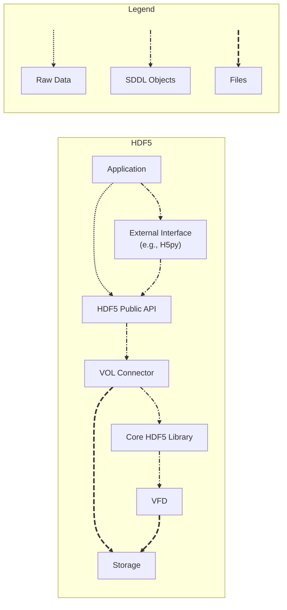
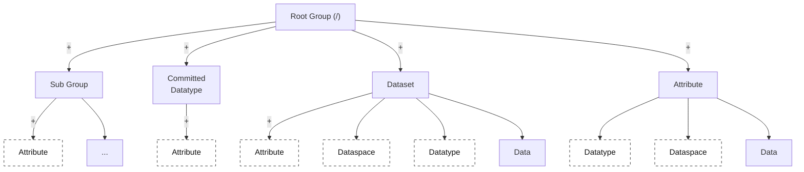
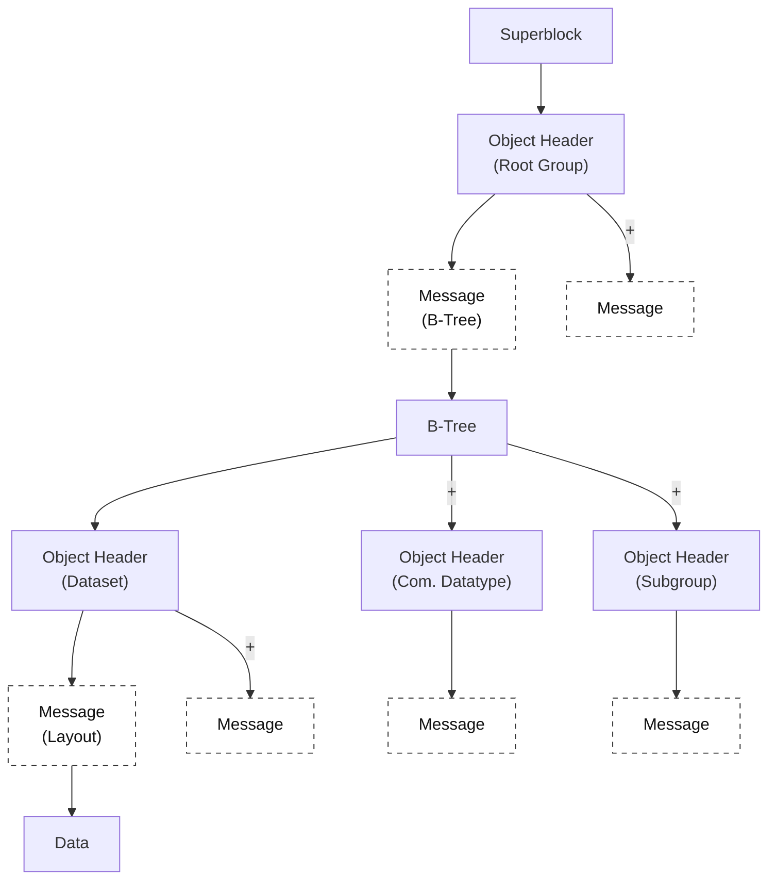

# HDF5 Security Threat Model

This document defines a *security* threat model for the HDF5 library and file format using the **CASSE** approach (“Core library, Application, Storage, System, External libraries”). CASSE was introduced specifically for data management libraries (DML) to overcome the limitations of traditional threat models such as STRIDE.

**Reference:** [https://dl.acm.org/doi/full/10.1145/3731599.3767556](https://dl.acm.org/doi/full/10.1145/3731599.3767556)

**Related evidence:** Recent model-loading work, including [*On the (In)Security of Loading Machine Learning Models*](https://arxiv.org/abs/2509.06703), shows that a file format being data-based does not by itself establish a security boundary. For HDF5 SSP, HDF5-backed model files, weight files, converters, and framework loaders should be modeled as application-level interpreters when they reconstruct model objects, layers, callables, external references, or other executable-adjacent state. See also the [Keras security advisories](https://github.com/keras-team/keras/security) for examples involving legacy HDF5 model loading and HDF5 external storage in model workflows.

## Contents

- [1) Scope and security goals](#1-scope-and-security-goals)
- [2) CASSE model](#2-casse-model)
- [3) Threat enumeration workflow](#3-threat-enumeration-workflow)
- [4) Practical examples](#4-practical-examples)
- [5) Attack register template](#5-attack-register-template)
- [6) Threat taxonomy aligned with HDF5 SSP SIG vulnerability categories](#6-threat-taxonomy-aligned-with-hdf5-ssp-sig-vulnerability-categories)
- [7) Checklist for reviewers](#7-checklist-for-reviewers)

## 1) Scope and security goals

### In scope

- HDF5 files (on disk structures and semantic expectations)
- Core HDF5 library (parsing, APIs, caching, SWMR, etc.)
- Extension points (VOL connectors, VFDs, filters, language bindings, tools)
- Build/distribution and “how users actually get HDF5” (packages, containers, CI outputs)
- HDF5-backed model and weight artifacts when HDF5 bytes are interpreted by higher-level loaders such as ML frameworks, converters, notebooks, services, or model hubs
- Typical deployments: desktop, HPC, cloud object stores, embedded/edge workflows

### Primary security goals (what we defend)

- **Integrity**: stored data/metadata and transformations are correct and detectable when incorrect
- **Availability**: reading/writing does not allow easy denial of service or resource exhaustion
- **Confidentiality** (where relevant): prevent unauthorized disclosure via security weaknesses
- **Execution safety**: parsing untrusted inputs must not lead to arbitrary code execution
- **Interpretation safety**: higher-level loaders must not reconstruct executable objects, model layers, or external-resource accesses from HDF5 content without explicit trust and containment
- **Trust-signal clarity**: file extensions, “safe” modes, scanner labels, and format names must not overstate the controls actually enforced on a given loading path
- **Supply chain integrity**: users can verify what code they are running

## 2) CASSE model

For security work, the most useful unit is the attack chain:

> **Source -> Method -> Target**

CASSE classifies attacks by combining:

- **Source**: `Data` or `Library`
- **Method**: `Modification` or `Poisoning`
- **Target**: one of `Core library`, `Application`, `Storage`, `System`, `External libraries`

For HDF5 SSP, a `Data` source includes ordinary HDF5 files, HDF5-backed model files, weight files, archives, and model-hub bundles. An `Application` target includes framework loaders and converters that transform HDF5 content or metadata into object graphs, model layers, callables, filesystem reads, network accesses, or generated code.

So an attack label looks like: **Data • Poisoning • Core library**.

CASSE is most effective when we maintain three complementary models.

### Data-flow diagram (DFD)

A DFD shows the layers/trust boundaries data passes through. For HDF5, this includes external data sources, the application, the core library, extensions (filters/VOL/VFD), and storage backends.



### Abstract data model

This model captures how HDF5 objects relate (groups, datasets, attributes, datatypes, etc.), data shape, element types and layout.



### Concrete/on-disk model

This model captures key on-disk structures and pointers/offsets that parsers traverse and where critical pointers/offsets/sizes are that attackers might target. For HDF5, this includes the superblock, object headers, B-trees, message lists, references, external links, etc.



## 3) Threat enumeration workflow

### Step 0 — Set boundaries and assumptions

Document:

- what inputs are **untrusted**
- where plugins may be loaded from
- where data may cross trust boundaries (internet, shared FS, object store)
- whether HDF5 artifacts are treated as passive data, active model artifacts, or partially executable configuration
- which user-facing security claims apply to which formats and loader paths
- which workloads must remain available (HPC job, cloud service, device)

### Step 1 — Build the DFD + identify trust boundaries

- Add a boundary anywhere the *trust level changes* (external file → internal parse, plugin load, network I/O, etc.)
- List the critical data flows: read path, write path, conversion, plugin discovery, distribution

### Step 2 — Model HDF5 structures that matter for attacks

Focus on:

- **links/offsets/pointers** (B-trees, message lists, references, external links)
- **sizes and counts** (datatype sizes, dataspace dims, chunk indexing, heap sizes)
- **parsing hot paths** (superblock, object headers, messages, filters, VFD/VOL entry points)

### Step 3 — Enumerate attacks using CASSE combinations

Start with the highest-risk combinations (typical for DMLs):

- **Data • Poisoning • Core library**
- **Data • Poisoning • Application** (for example, model/object loaders that reconstruct code-bearing state from file content)
- **Data • Poisoning • External libraries**
- **Library • Poisoning • Application/System/Storage**
- **Data • Poisoning • Storage** (DML-controlled I/O patterns can DoS backends)

### Step 4 — Attach vulnerability mechanisms and evidence

For each attack, record:

- which **CWE-like weakness** it uses (bounds errors, integer overflows, improper validation, unsafe deserialization, confused-deputy file access, etc.)
- which components are affected (format parser, filter pipeline, plugin loader, tool, framework loader, converter)
- which loader/interpreter semantics are relevant (object reconstruction, Lambda/custom layer resolution, external storage or link traversal, dynamic import, asset loading)
- whether a user-facing “safe” mode, scanner label, extension, or format name is an enforceable boundary or only advisory feedback
- how to reproduce (test case, fuzz seed, PoC file)
- expected impact and exploitability (rough triage is fine at first)

### Step 5 — Map to HDF5 SSP SIG vulnerability categories

The HDF5 SSP SIG uses categories spanning the stack (FMT, LIB, EXT, TCD, OPS, PRV, SCD, UNK). For each CASSE attack entry, tag it with **one or more** of these categories (see §6).

### Step 6 — Turn threats into mitigations + tests

Threat modeling is only “done” when we create:

- mitigations (code changes, defaults, policies, docs)
- regression tests (fuzz seeds, negative tests, signature checks, legacy-format checks, “safe mode is enforced or rejected” checks)
- operational guidance (hardening options, safe configs, containment guidance for untrusted model artifacts)

## 4) Practical examples

### Example 1 — Data • Poisoning • Core library (FMT/LIB)

**Scenario**: A crafted HDF5 file triggers a parsing edge case leading to out-of-bounds write.

- Source: Data (untrusted file)
- Method: Poisoning (malicious file distributed)
- Target: Core library
- Likely categories: **FMT**, **LIB**
- Typical outcomes: crash, memory corruption, possible code execution

**Mitigations**:

- bounds checks and sanity limits for counts/offsets
- fuzzing (including checksum/integrity-aware fuzzing where relevant)
- “fail-closed” parsing policies for invalid structures

### Example 2 — Data • Poisoning • External libraries (EXT/TCD/SCD)

**Scenario**: A workflow reads a file that causes it to load a third-party filter/VOL/VFD with unsafe behavior.

- Source: Data
- Method: Poisoning (file expects a plugin/filter by ID or environment-driven discovery)
- Target: External libraries (plugins)
- Likely categories: **EXT**, **SCD**, sometimes **OPS** (misconfiguration)

**Mitigations**:

- policy-driven plugin loading (allowlist, version constraints)
- signature verification for plugins
- sandboxing/isolation for plugin execution

### Example 3 — Data • Poisoning • Storage (OPS)

**Scenario**: An attacker publishes a dataset with extremely small chunks so reading it causes many tiny I/O ops, overloading a shared filesystem or object store.

- Source: Data
- Method: Poisoning
- Target: Storage
- Likely categories: **OPS** (and possibly **FMT** if layout metadata is abused)

**Mitigations**:

- enforce minimum chunk sizes / I/O rate limits in pipelines
- preflight scanning of chunk layouts before “full ingest”
- storage-side throttling and workload isolation

### Example 4 — Library • Poisoning • System (SCD/TCD)

**Scenario**: A trojanized HDF5 binary/package is installed and executes arbitrary code on load.

- Source: Library
- Method: Poisoning (compromised distribution)
- Target: System
- Likely categories: **SCD**, **TCD**

**Mitigations**:

- signed artifacts, verified provenance, reproducible builds
- SBOMs + dependency pinning
- constrained execution environments for high-risk contexts

### Example 5 — Data • Poisoning • Application (LIB/TCD/OPS/SCD)

**Scenario**: An HDF5-backed ML model or weight artifact is downloaded from a model hub, repository, paper supplement, or partner workflow and passed to a framework loader. The framework treats the artifact as more than numeric arrays: it may reconstruct model architecture, Lambda layers, custom objects, asset paths, external references, or other executable-adjacent state. A user may believe the file is safe because it is “data-based,” has an `.h5`/`.hdf5` extension, was scanner-labeled as safe, or was loaded with a flag named like a security boundary.

- Source: Data
- Method: Poisoning
- Target: Application, sometimes External libraries and System
- Likely categories: **LIB**, **TCD**, **OPS**, **SCD**, sometimes **FMT** and **PRV**
- Typical outcomes: arbitrary code execution, local file disclosure, network access, privilege misuse inside the loader process, or over-trust of an unsupported safety mode

**Mitigations**:

- treat untrusted model artifacts as code, not passive datasets
- prefer weights-only or constrained operator formats for cross-boundary sharing when feasible
- load untrusted model artifacts in a sandboxed or separate low-privilege process with a restricted filesystem and network view
- reject or explicitly warn on legacy/self-contained model formats when the requested security mode cannot be enforced
- preflight inspect HDF5 artifacts for external links, external storage, unexpected plugin/filter requirements, object-like metadata, and path-bearing attributes before full framework loading
- test each supported file extension and legacy path to verify that security flags, scanner labels, and policy checks fail closed rather than being silently ignored

## 5) Attack register template

```markdown
## ATK-###: <short name>
- CASSE: <Data|Library> • <Modification|Poisoning> • <Core|App|Storage|System|External>
- HDF5 SSP vulnerability tags: <FMT|LIB|EXT|TCD|OPS|PRV|SCD|UNK>
- Preconditions:
- Trigger / entry point:
- Vulnerability mechanism (CWE-style):
- Loader / interpreter semantics: <raw arrays|metadata parser|plugin load|object reconstruction|model graph|external reference|unknown>
- User-facing trust signal: <extension|safe mode|scanner label|signature|provenance|none>
- Expected impact:
- Exploitability notes:
- Isolation / privilege context:
- Detection:
- Mitigations:
- Tests / evidence:
- Owner / status / milestone:
```

## 6) Threat taxonomy aligned with HDF5 SSP SIG vulnerability categories

Use this table to tag each threat (many threats span multiple categories):

| Vulnerability category | What to look for in a security review | CASSE targets most often affected |
| --- | --- | --- |
| **FMT** (File format) | ambiguous specs, crafted structures, pointer/offset abuse, malformed metadata, external references, format features interpreted by application loaders | Core library, Application, Storage |
| **LIB** (Core library) | memory safety bugs, UB, race conditions, insecure defaults, parsing hot paths, unsafe reconstruction/deserialization paths in library-adjacent loaders | Core library, Application, System |
| **EXT** (Extensions/plugins) | plugin hijacking, unsafe filters/VOL/VFD, covert channels, privilege misuse | External libraries, System, Storage |
| **TCD** (Toolchain/deps) | vulnerable deps, unpinned builds, insecure build scripts, wrapper flaws, ML framework loader behavior, converter drift | Application, External libraries, System |
| **OPS** (Operational/usage) | misconfigurations, unsafe file sharing, logging leaks, missing access controls, over-trust of safe flags or scanner labels, loading untrusted model artifacts without containment | Application, Storage |
| **PRV** (Privacy-specific) | security weaknesses that enable disclosure, including external-reference reads and artifact metadata disclosure (distinct from accidental exposure) | Core library, Application, External |
| **SCD** (Supply chain/dist.) | unsigned artifacts, typosquatting, compromised repos, model-hub provenance gaps, unverified shared artifacts | System, Application |
| **UNK** (Unknown) | novel vulnerability classes, cross-layer chains | Any |

## 7) Checklist for reviewers

### When a change touches parsing or on-disk structures

- [ ] require negative tests for invalid sizes/offsets
- [ ] add fuzz seeds for new messages/layouts
- [ ] add explicit resource limits (time/memory)

### When a change touches plugin loading

- [ ] document trust assumptions
- [ ] provide a safe default (deny/allow list) for high-risk contexts
- [ ] add tests for path hijack and “fail closed” behavior

### When a change touches model artifacts, object loaders, converters, or user-facing security claims

- [ ] Does the loader interpret HDF5 content as model architecture, object graphs, callables, asset paths, or external references rather than only numeric arrays?
- [ ] Are legacy and current formats covered by the same security controls, or does an unsupported path fail closed with an explicit error or warning?
- [ ] Can any `safe_mode`, scanner label, signature, or extension-based decision be silently ignored on a supported path?
- [ ] Are external links, external storage, object-like metadata, custom objects, Lambda layers, dynamic imports, and plugin requirements disabled, constrained, or explicitly reviewed for untrusted artifacts?
- [ ] Is process isolation recommended or required for model artifacts from outside the trust boundary?

### When a change touches distribution

- [ ] ensure artifacts are signed and verifiable
- [ ] publish SBOMs
- [ ] ensure CI produces reproducible outputs where feasible
  