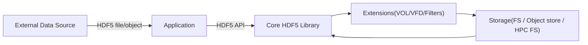

# HDF5 Security Threat (Attack) Model — CASSE-based

This document defines a *security* threat model for the HDF5 ecosystem using the **CASSE** approach (“Core library, Application, Storage, System, External libraries”). CASSE was introduced specifically for data management libraries (DMLs).

**Reference:** https://dl.acm.org/doi/full/10.1145/3731599.3767556

## 1) Scope and security goals

### In scope

- HDF5 files (on disk structures and semantic expectations)
- Core HDF5 library (parsing, APIs, caching, SWMR, etc.)
- Extension points (VOL connectors, VFDs, filters, language bindings, tools)
- Build/distribution and “how users actually get HDF5” (packages, containers, CI outputs)
- Typical deployments: desktop, HPC, cloud object stores, embedded/edge workflows

### Primary security goals (what we defend)

- **Integrity**: stored data/metadata and transformations are correct and detectable when incorrect
- **Availability**: reading/writing does not allow easy denial of service or resource exhaustion
- **Confidentiality** (where relevant): prevent unauthorized disclosure via security weaknesses
- **Execution safety**: parsing untrusted inputs must not lead to arbitrary code execution
- **Supply chain integrity**: users can verify what code they are running

## 2) CASSE in one page

CASSE classifies attacks by combining:

- **Source**: `Data` or `Library`
- **Method**: `Modification` or `Poisoning`
- **Target**: one of `Core library`, `Application`, `Storage`, `System`, `External libraries`

So an attack label looks like: **Data • Poisoning • Core library**.

### 2.1 CASSE modeling artifacts (required)

CASSE is most effective when you maintain three complementary models:

1. **Data-flow diagram (DFD)**: layers/trust boundaries data passes through
2. **Abstract data model**: how HDF5 objects relate (groups, datasets, attributes, datatypes, etc.)
3. **Concrete/on-disk model** (where relevant): key on-disk structures and pointers/offsets that parsers traverse

Example starter DFD for HDF5-based apps:



## 3) Threat enumeration workflow (CASSE)

### Step 0 — Set boundaries and assumptions

Document:

- what inputs are **untrusted**
- where plugins may be loaded from
- where data may cross trust boundaries (internet, shared FS, object store)
- which workloads must remain available (HPC job, cloud service, device)

### Step 1 — Build the DFD + identify trust boundaries

- Add a boundary anywhere the *trust level changes* (external file → internal parse, plugin load, network I/O, etc.)
- List the critical data flows: read path, write path, conversion, plugin discovery, distribution

### Step 2 — Model HDF5 structures that matter for attacks

Focus on:

- **links/offsets/pointers** (B-trees, message lists, references, external links)
- **sizes and counts** (datatype sizes, dataspace dims, chunk indexing, heap sizes)
- **parsing hot paths** (superblock, object headers, messages, filters, VFD/VOL entry points)

### Step 3 — Enumerate attacks using CASSE combinations

Start with the highest-risk combinations (typical for DMLs):

- **Data • Poisoning • Core library**
- **Data • Poisoning • External libraries**
- **Library • Poisoning • Application/System/Storage**
- **Data • Poisoning • Storage** (DML-controlled I/O patterns can DoS backends)

### Step 4 — Attach vulnerability mechanisms and evidence

For each attack, record:

- which **CWE-like weakness** it uses (bounds errors, integer overflows, improper validation, unsafe deserialization, etc.)
- which components are affected (format parser, filter pipeline, plugin loader, tool)
- how to reproduce (test case, fuzz seed, PoC file)
- expected impact and exploitability (rough triage is fine at first)

### Step 5 — Map to HDF5 SSP SIG vulnerability categories

The HDF5 SSP SIG uses categories spanning the stack (FMT, LIB, EXT, TCD, OPS, PRV, SCD, UNK). For each CASSE attack entry, tag it with **one or more** of these categories (see §6).

### Step 6 — Turn threats into mitigations + tests

Threat modeling is only “done” when you create:

- mitigations (code changes, defaults, policies, docs)
- regression tests (fuzz seeds, negative tests, signature checks)
- operational guidance (hardening options, safe configs)

## 4) Practical examples (CASSE style)

### Example 1 — Data • Poisoning • Core library (FMT/LIB)

**Scenario**: A crafted HDF5 file triggers a parsing edge case leading to out-of-bounds write.

- Source: Data (untrusted file)
- Method: Poisoning (malicious file distributed)
- Target: Core library
- Likely categories: **FMT**, **LIB**
- Typical outcomes: crash, memory corruption, possible code execution

**Mitigations**

- bounds checks and sanity limits for counts/offsets
- fuzzing (including checksum/integrity-aware fuzzing where relevant)
- “fail-closed” parsing policies for invalid structures

### Example 2 — Data • Poisoning • External libraries (EXT/TCD/SCD)

**Scenario**: A workflow reads a file that causes it to load a third-party filter/VOL/VFD with unsafe behavior.

- Source: Data
- Method: Poisoning (file expects a plugin/filter by ID or environment-driven discovery)
- Target: External libraries (plugins)
- Likely categories: **EXT**, **SCD**, sometimes **OPS** (misconfiguration)

**Mitigations**

- policy-driven plugin loading (allowlist, version constraints)
- signature verification for plugins
- sandboxing/isolation for plugin execution

### Example 3 — Data • Poisoning • Storage (OPS)

**Scenario**: An attacker publishes a dataset with extremely small chunks so reading it causes many tiny I/O ops, overloading a shared filesystem or object store.

- Source: Data
- Method: Poisoning
- Target: Storage
- Likely categories: **OPS** (and possibly **FMT** if layout metadata is abused)

**Mitigations**

- enforce minimum chunk sizes / I/O rate limits in pipelines
- preflight scanning of chunk layouts before “full ingest”
- storage-side throttling and workload isolation

### Example 4 — Library • Poisoning • System (SCD/TCD)

**Scenario**: A trojanized HDF5 binary/package is installed and executes arbitrary code on load.

- Source: Library
- Method: Poisoning (compromised distribution)
- Target: System
- Likely categories: **SCD**, **TCD**

**Mitigations**

- signed artifacts, verified provenance, reproducible builds
- SBOMs + dependency pinning
- constrained execution environments for high-risk contexts

## 5) Artifacts to keep in the repository

Suggested layout:

```text
models/
  Security Threats.md
  Security/
    dfd.mmd
    data-model-abstract.mmd
    data-model-ondisk.mmd
    attack-register.md
    mitigations-backlog.md
    test-plan.md
```

### 5.1 Attack register template (copy/paste)

```markdown
## ATK-###: <short name>
- CASSE: <Data|Library> • <Modification|Poisoning> • <Core|App|Storage|System|External>
- HDF5 SSP vulnerability tags: <FMT|LIB|EXT|TCD|OPS|PRV|SCD|UNK>
- Preconditions:
- Trigger / entry point:
- Vulnerability mechanism (CWE-style):
- Expected impact:
- Exploitability notes:
- Detection:
- Mitigations:
- Tests / evidence:
- Owner / status / milestone:
```

## 6) Threat taxonomy aligned with HDF5 SSP SIG vulnerability categories

Use this table to tag each threat (many threats span multiple categories):

| Vulnerability category | What to look for (security lens) | CASSE targets most often affected |
| --- | --- | --- |
| **FMT** (File format) | ambiguous specs, crafted structures, pointer/offset abuse, malformed metadata | Core library, Storage |
| **LIB** (Core library) | memory safety bugs, UB, race conditions, insecure defaults, parsing hot paths | Core library, System |
| **EXT** (Extensions/plugins) | plugin hijacking, unsafe filters/VOL/VFD, covert channels, privilege misuse | External libraries, System, Storage |
| **TCD** (Toolchain/deps) | vulnerable deps, unpinned builds, insecure build scripts, wrapper flaws | Application, External libraries, System |
| **OPS** (Operational/usage) | misconfigurations, unsafe file sharing, logging leaks, missing access controls | Application, Storage |
| **PRV** (Privacy-specific) | security weaknesses that enable disclosure (distinct from accidental exposure) | Core library, Application, External |
| **SCD** (Supply chain/dist.) | unsigned artifacts, typosquatting, compromised repos, provenance gaps | System, Application |
| **UNK** (Unknown) | novel vulnerability classes, cross-layer chains | Any |

## 7) “Tight” guidance for reviewers

### When a change touches parsing or on-disk structures

- require negative tests for invalid sizes/offsets
- add fuzz seeds for new messages/layouts
- add explicit resource limits (time/memory)

### When a change touches plugin loading

- document trust assumptions
- provide a safe default (deny/allowlist) for high-risk contexts
- add tests for path hijack and “fail closed” behavior

### When a change touches distribution

- ensure artifacts are signed and verifiable
- publish SBOMs
- ensure CI produces reproducible outputs where feasible
